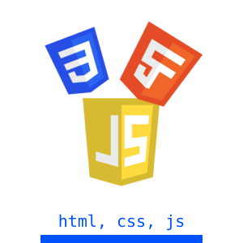
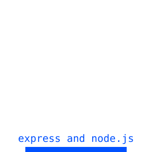
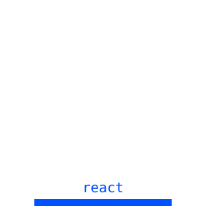
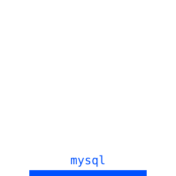

<div align="center">

<!-- BEGIN YOUTUBE-CARDS -->
[](https://www.youtube.com/watch?v=hhIiZ4YOoQo)
[](https://www.youtube.com/watch?v=x7QOEK7-Kok)
[](https://www.youtube.com/watch?v=iYEdC01mWfY)
<!-- END YOUTUBE-CARDS -->

</div>
<!--
<div align="center">
  
</div>
> Vinland Saga (peak series btw)
-->

- Still codes by hand.
- Studying at USTP CDO (2nd yearist).
- I jus love codwing.

---

## Tools and Experience

<div align="center">
	
	
	
	
	
	
</div>

<br/>

<p align="center">
	<!-- Github Rating -->
    
	&nbsp;&nbsp;&nbsp;&nbsp;
	<!-- Programming languages percentage -->
    
</p>

<!-- My own svg test -->


> Neovim + Kitty 🤌

---

## Contacts
<div align="center">
<a href="https://banacount.github.io/">
  
</a>


	
{[Youtube](https://www.youtube.com/@johval) ,
[Facebook](https://www.facebook.com/johnrushell.valmoria/) ,
[Instagram](https://www.instagram.com/vall.iso/) ,
[All links](https://banacount.github.io/?page=about)}
</div>

<details>
<summary>PC Specs</summary>
	
```
                  -`                     excalibur@excalibur
                 .o+`                    -------------------
                `ooo/                    OS: Arch Linux x86_64
               `+oooo:                   Host: OptiPlex 3040
              `+oooooo:                  Kernel: Linux 6.18.35-1-lts
              -+oooooo+:                 Uptime: 7 hours, 23 mins
            `/:-:++oooo+:                Packages: 24 (flatpak), 1436 (pacman)
           `/++++/+++++++:               Shell: zsh 5.9.1
          `/++++++++++++++:              Display (HDMI-1): 1440x900, 60 Hz [External]
         `/+++ooooooooooooo/`            WM: dwm (X11)
        ./ooosssso++osssssso+`           Theme: HighContrastInverse [GTK3]
       .oossssso-````/ossssss+`          Icons: Adwaita [GTK3]
      -osssssso.      :ssssssso.         Font: Adwaita Sans (11pt) [GTK3]
     :osssssss/        osssso+++.        Cursor: Adwaita (24px)
    /ossssssss/        +ssssooo/-        Terminal: tmux 3.6b
  `/ossssso+/:-        -:/+osssso+-      CPU: Intel(R) Core(TM) i3-6100T (4) @ 3.20 GHz
 `+sso+:-`                 `.-/+oso:     GPU: Intel HD Graphics 530 @ 0.95 GHz [Integrated]
`++:.                           `-/+/    Memory: 4.78 GiB / 7.65 GiB (62%)
.`                                 `/    Swap: 62.43 MiB / 3.83 GiB (2%)
                                         Disk (/): 119.18 GiB / 446.13 GiB (27%) - btrfs
                                         Local IP (enp0s20f0u10): 192.168.101.224/24
                                         Locale: en_US.UTF-8
```
</details>

